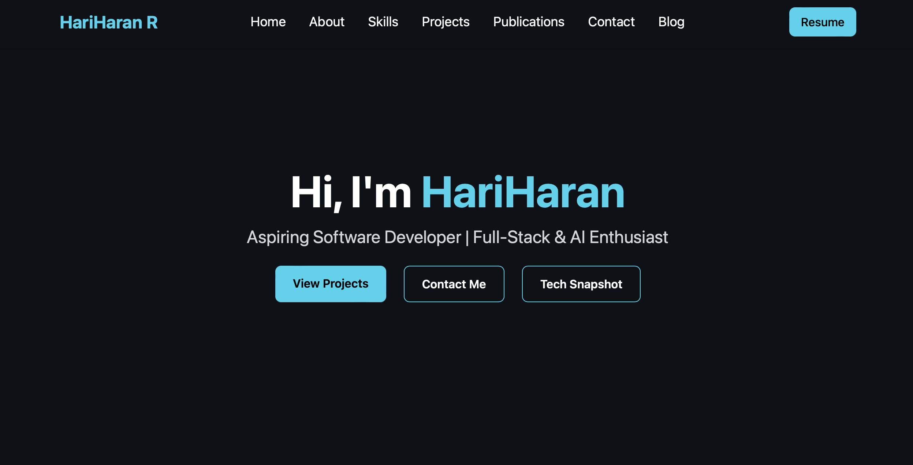
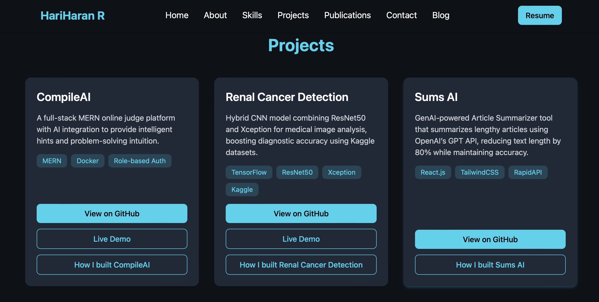

# Portfolio

# 🌐 Personal Portfolio

This is my personal portfolio website built with [Vite](https://vitejs.dev/), [React](https://react.dev/), and deployed on [Vercel](https://vercel.com/).

🔗 **Live Demo:** [hariharan-portfolio-pi.vercel.app](https://hariharan-portfolio-pi.vercel.app)

---

## ✨ Features
- Modern and minimal UI
- Fully responsive design (mobile-friendly)
- Hero section
- About Me section
- Skills & Projects showcase
- Contact, Publications,Footer section

---

## 🛠️ Tech Stack
- **Frontend:** React, Vite, Tailwind CSS
- **Deployment:** Vercel

---

## 🚀 Getting Started

### Clone the repo
```bash
git clone https://github.com/theHARI962n/My-Portfolio.git
cd portfolio
```

## Screenshots




